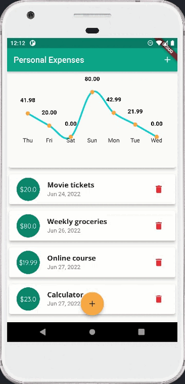

# personal_expense

> This project is a Flutter mobile application that enables users to create, store, check and delete expense record in real-time manner. A variety of Dart widgets are cretaed to build the compiled applications in Flutter framework. A third-party library fl_chart to create visualized line chart to display the sum of daily expense. It also applied Sqlflite to store persistence data.

## Table of Contents

- [Technologies Used](#technologies-used)
- [Features](#features)
- [Screenshots](#screenshots)
- [Learning Points](#learning-points)
<!-- * [License](#license) -->

## Technologies Used

- Flutter framework
- Dart
- Sqflite
- fl_chart

## Features

The ready features are:

- An interactive input text allowing user to enter expense details including title, amount and date.
- Provides a line chart displaying daily expense amount.
- Provides persistence data storage using Sqflite.

## Screenshots

 

## Learning Points

- Learned foundamentals of Android such as layout, fragment and Animation library.
- Learned how Java is applied in Android application.
